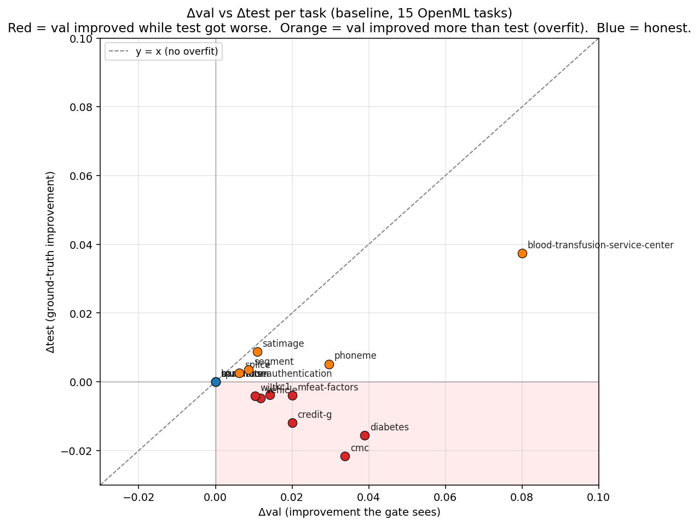
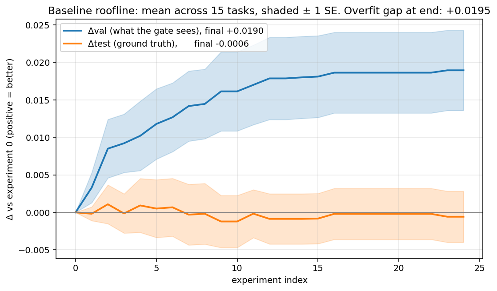
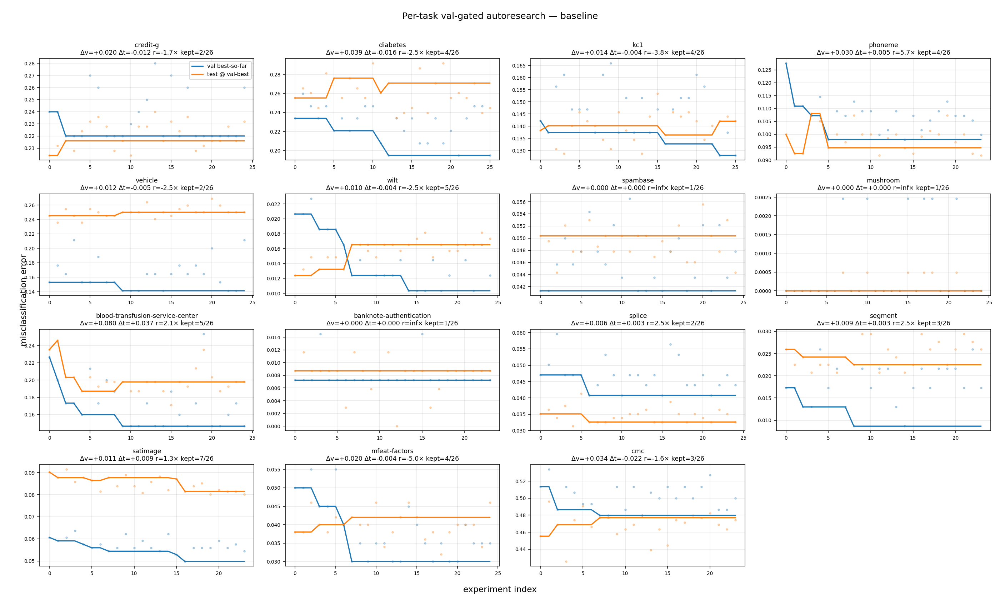
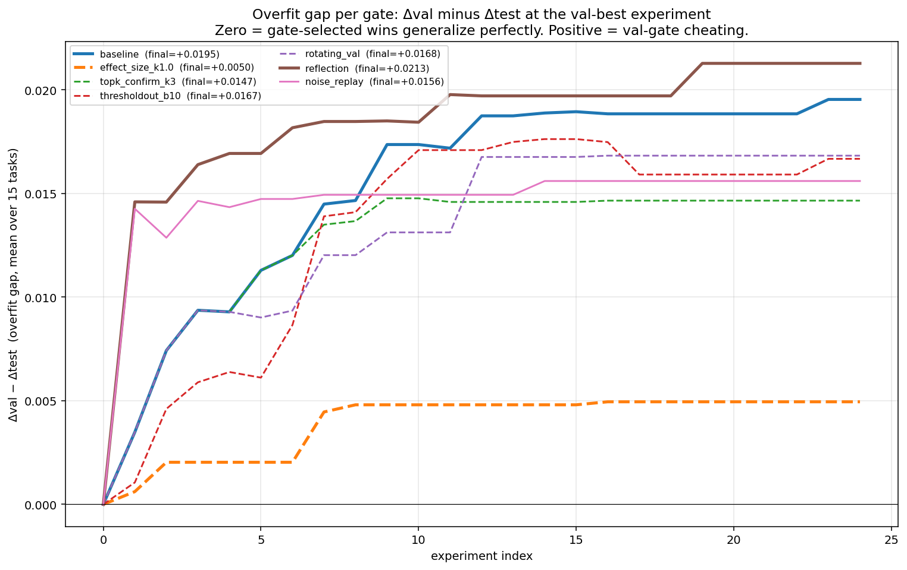
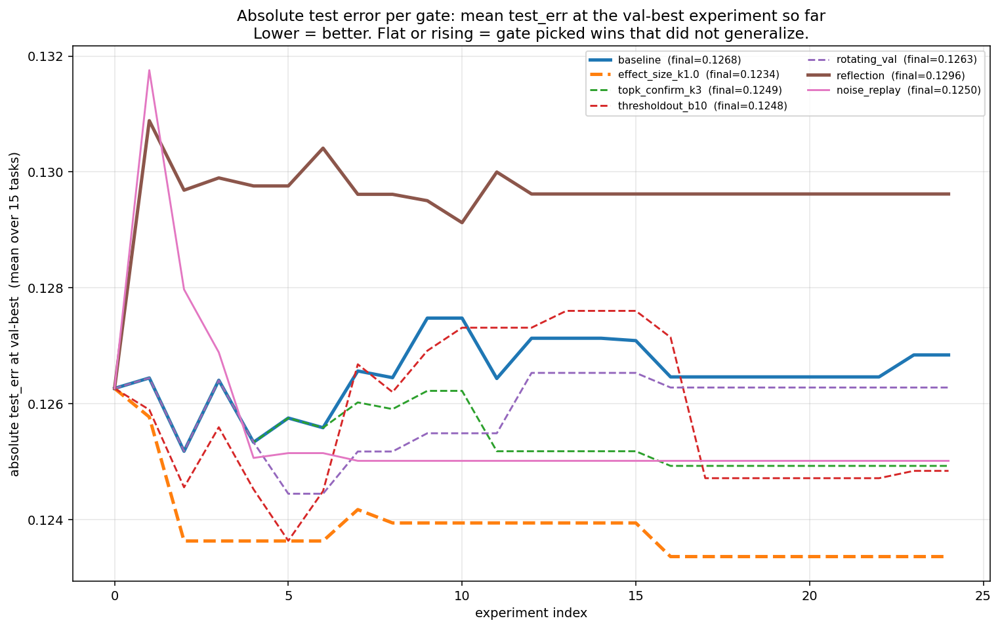

# Auto-Overfit: Measuring and Reducing Overfitting in Autoresearch

## 1. Motivation and Summary

[Karpathy's autoresearch](https://github.com/karpathy/autoresearch) is a simple, compelling pattern: an LLM agent edits `train.py`, runs a fixed training budget, accepts or rejects the edit based on a validation metric on a holdout slice, on repeat. You sleep and wake up to a better model.

The structural worry is **adaptive holdout reuse**1: every accept/reject decision leaks information from the val set into the agent's trajectory, even if the val set is different from the train set. After many experiments, val error starts acting like train error. The original autoresearch repository had a crystal clear example in [autoresearch issue #131](https://github.com/karpathy/autoresearch/issues/131): the last accepted "win" in an overnight run turned out to be a random seed change.

I also noticed in my own quantitative research projects that this pattern was a problem. For instance, given a canonical basketball analytics problem like RAPM (predicting the points scored on a possession given the 5 offensive and 5 defensive players), an autoresearch agent started creating features out of pairs of players, a clear overfitting signal on a small dataset.

This study measures the effect on tabular ML tasks from OpenML2 with an XGBoost baseline3.

Headline results:

- **The basic autoresearch loop overfits to validation "wins" that do not show up on test.** Val improved +0.019; test moved −0.0006, indistinguishable from zero. The val−test gap is +0.020 (paired p = 0.001).
- **Requiring a significant effect size to beat the validation noise floor fixes most of the problem.** Accepting only changes with Δval > 1·σ_val cuts the mean overfit gap to +0.005 (p = 0.004) and flips mean Δtest from −0.0006 to +0.003. The Δtest improvement alone is not significant at n = 15 (one-sided p = 0.06); the gap reduction is.
- **Asking the LLM to reflect on the source of overfitting did not help.** Showing the proposer train/val diagnostics and asking it to avoid likely noise wins produced gap +0.021 (p = 0.75) and Δtest −0.003, neither statistically different from the plain val-gate baseline.

## 2. Harness

Each of the 15 OpenML classification tasks runs as its own independent autoresearch loop. Per-task isolation means each loop owns a separate `train.py`, a separate experiment history, and a separate LLM conversation; they never see each other's results. Each task is stratified into a 65/10/25 train/val/test split with a fixed seed.

**Baseline.** An untuned `XGBClassifier` with library defaults. The file is deliberately thin, so there's lots of obvious room for the LLM to mutate (learning rate, depth, regularization, feature engineering, etc.).

**Proposer.** One live Sonnet 4.5 call per experiment. Each turn the prompt is: a fixed system preamble naming the task, a rulebook listing what the agent may mutate (learning rate, depth, regularization, feature engineering, seed ensembles, etc.) and what it may not (split, prepare step, test slice), the current `train.py` in full, and the last 10 experiments as a compact history (index, status, `val_err`, the LLM's own one-line description).

**Val-gate.** Strict accept iff `val_err < best_val`. Kept proposals overwrite `train.py`, discarded ones are rolled back.

**Silent test slice.** The test slice is held by the harness and never exposed to anything the agent sees. Every evaluation computes val and test side by side, but the loop only ever receives val. Test lands in a private log that no proposer, gate, or program rule reads, and an AST check on each proposed file rejects any reference to the test slice or that log.

## 3. Baseline autoresearch, the overfit phenomenon

Each point is one task. The dashed diagonal is what honest progress looks like: val improvement matches test improvement. Orange points fall short of that line; red points fall below zero on test, meaning val improved but test actually got worse. That happens in 7 of the 12 tasks with any movement.

Averaged over 15 tasks: val descends as expected (blue), but test stays flat at zero (orange). The gap between the two curves is the adaptive-holdout overfit.

Per-task trajectories. X = experiment index, Y = error rate. Solid blue = best val so far, solid orange = test at that val-winning experiment. When blue descends and orange stays flat or rises, that gap is the overfit.

### 3.1 Per-task summary

Sorted by Δval / Δtest ratio (most honest first, most overfit last). The v/t column is this ratio: a positive value means val and test moved the same direction; a negative value means val improved while test regressed.

| task | n | kept | Δval | Δtest | v/t |
|---|---:|---:|---:|---:|---:|
| spambase | 25 | 1 | +0.000 | +0.000 | no movement |
| mushroom | 25 | 1 | +0.000 | +0.000 | no movement |
| banknote-authentication | 24 | 1 | +0.000 | +0.000 | no movement |
| phoneme | 24 | 4 | +0.030 | +0.005 | 5.71× |
| segment | 24 | 3 | +0.009 | +0.003 | 2.50× |
| splice | 25 | 2 | +0.006 | +0.003 | 2.50× |
| blood-transfusion-service-center | 25 | 5 | +0.080 | +0.037 | 2.14× |
| satimage | 24 | 7 | +0.011 | +0.009 | 1.25× |
| cmc | 24 | 3 | +0.034 | **−0.022** | **−1.56×** |
| credit-g | 25 | 2 | +0.020 | **−0.012** | **−1.67×** |
| diabetes | 26 | 4 | +0.039 | **−0.016** | **−2.49×** |
| vehicle | 25 | 2 | +0.012 | **−0.005** | **−2.49×** |
| wilt | 25 | 5 | +0.010 | **−0.004** | **−2.50×** |
| kc1 | 26 | 4 | +0.014 | **−0.004** | **−3.75×** |
| mfeat-factors | 25 | 4 | +0.020 | **−0.004** | **−5.00×** |

### 3.2 Aggregate overfit statistics

- Mean Δval +0.019 (95% CI [+0.010, +0.030]), mean Δtest −0.0006 (CI [−0.006, +0.006]).
- Mean overfit gap (Δval − Δtest) +0.020, paired-Wilcoxon p = 0.001.
- Of the 12 tasks with metric movement, 7 show val improving while test regresses (negative ratio). Only 5 show the honest pattern where val and test move together.
- Median val:test ratio across the 12 tasks with movement: −1.61×.

For example, an autoresearch user looking only at val would think they'd saved ~4% error on `diabetes` when the true test effect is *negative* (test got 1.6pp worse). On 7/12 tasks the val-only reader thinks they've *improved* the model when test error has in fact *increased*.

### 3.3 Examples

Experiments where the LLM proposed an edit, the val-gate accepted it, and the silent test log showed it made things worse. Top entries included:

1. **`diabetes` i=5**, *"Set subsample=0.8 and colsample_bytree=0.8 to add stochastic regularization"*. Val −0.013, test +0.021 (test regressed 2.1pp, 1.6× larger than the val "gain"). Accepted.
2. **`cmc` i=2**, *"Lower learning_rate to 0.1 to improve generalization with smaller gradient steps"*. Val −0.027, test +0.014.
3. **`credit-g` i=2**, *"Reduce max_depth from default 6 to 3 to prevent overfitting on this relatively small dataset"*. Val −0.020, test +0.012.
4. **`vehicle` i=9**, *"Add reg_alpha=1.0 for L1 regularization to encourage feature sparsity"*. Val −0.012, test +0.005.
5. **`diabetes` i=12**, *"Set n_estimators=150 to allow more boosting iterations"*. Val −0.013, test +0.010.

Although most of the accepted fixes looked reasonable, and none was as egregious as simply changing a random seed, the loop still encouraged a search over hyperparameters that overfit to val at the cost of generalization. For example the `diabetes` i=5 case is a textbook regularization edit that lowered val by 1.3% but made test 2.1% worse, so it was a "win" under the val-gate and a regression under ground truth.

## 4. Mitigations

We experimented with the following mitigations to the overfitting problem.4 We report a single representative setting per mitigation.5 Significance tests throughout are paired Wilcoxon signed-rank at n = 15 tasks; the per-gate bootstrap CIs and raw test statistics live in `results/_summary/significance.json` in the repo (currently private).

| mitigation | what / why | cost |
|---|---|---|
| **effect-size gating** | Accept only if Δval > k × σ_val, where σ_val is the bootstrap standard error of val_err on the val slice. Small-perturbation noise wins are smaller than σ and get blocked. | Needs σ estimate (one extra model fit per task). Blocks some small wins. |
| **thresholdout budget** | [Dwork et al.] Add noise ~ Laplace(σ) to val_err, and only allow b "fresh reveals". Once budget is spent, the agent must rely on cached noisy answers. | Limits gate budget; gate becomes blind after b accepts. |
| **rotating val** | Partition the val slice into K disjoint folds; evaluate experiment `i` on fold `i mod K` with a per-fold running best. Memorizing a specific sample fails because each fold is only revisited every K experiments. | Per-fold val has higher variance than full-val, so the gate sees noisier signals. |
| **top-K confirmation** | After the greedy val-gated search finishes, re-evaluate the top K surviving candidates on a fresh re-sample and pick the best on the re-eval. Stops the run from committing to whichever candidate got the luckiest single val draw. | Post-hoc, easy to add. Shifts which experiment "wins" without changing the kept count. |
| **reflection (proposer-side)** | Fresh LLM loop. Each turn the agent is shown `train_err`, Δtrain vs Δval, running σ, recent-keep pattern. Asked to label proposals `[real]` vs `[noise-avoid]` and propose qualitatively different kinds of changes after a suspected noise win. | 1–2× prompt tokens, extra LLM attention budget. |

### 4.1 Comparison

Overfit gap (Δval − Δtest) per gate, averaged across 15 tasks. 0 = perfect generalization, positive = val-gate cheating:

Absolute test_err at val-best per gate:

Summary table with paired Wilcoxon signed-rank tests (one-sided) on the per-task overfit-gap reduction vs baseline:

| gate | median v/t | μ Δval | μ Δtest | kept / 375 | mean gap | p(gap < baseline) | sig α=0.05 |
|---|---:|---:|---:|---:|---:|---:|:---:|
| baseline | −1.61× | +0.019 | −0.001 | 48 | +0.020 | — | — |
| **effect_size k = 1.0** (recommend) | **+1.46×** | +0.008 | **+0.003** | 21 | **+0.005** | **0.004** | ✓ |
| topk_confirm k = 3 | −0.14× | +0.016 | +0.001 | 48 | +0.015 | **0.023** | ✓ |
| rotating_val | −1.61× | +0.017 | −0.000 | 94 | +0.018 | 0.040 | ✓ |
| thresholdout b = 10 | −0.15× | +0.019 | +0.001 | 43 | +0.018 | 0.327 | ✗ |
| reflection | −0.94× | +0.018 | −0.003 | 40 | +0.021 | 0.747 | ✗ |

Full per-task-per-gate breakdown is in `results/_summary/gate_comparison_table.json` in the repo (currently private).

### 4.2 Mitigation analysis

Effect_size k = 1.0 is the cleanest mitigation. The gap flips from +0.020 to +0.005 (p = 0.004), mean Δtest flips from −0.0006 to +0.003, no task shows extreme overfit (v/t ≥ 3), and 21 of the 48 baseline keeps survive, the ones that beat the noise floor by at least 1σ. The tradeoff is that at n = 15 no gate significantly *improves* Δtest on its own; the gates stop val-gated runs from hurting test rather than making it notably better.

Topk_confirm is nearly free and cuts the gap at p = 0.023. Keep count is unchanged since it's a post-hoc re-selection, not a gate. Run your greedy search, then make the final pick on a fresh internal holdout drawn from train+val.

Rotating val (disjoint folds, gate decides on fold-val) lands at gap +0.018 (p = 0.040), marginally significant. The gate accepts ~2× more experiments (94 vs 48) because each per-fold val is smaller and noisier, so small folds hit low values by chance. A principled version resamples val from (train ∪ val) per experiment instead of partitioning a fixed val, but that breaks the "train is never touched" story. See §6.

Thresholdout b = 10 did not help at p = 0.33. The reveal budget burns out in the first ~10 accepts; after that the agent is guessing and noise wins slip through the noisy reveal. Results are also sensitive to the Laplace noise scale.

Reflection did not reduce the gap (p = 0.75) and trended worse on Δtest (p = 0.17, one-sided). My guess is giving the model σ and "last win looks like noise" signals makes it *more* confident that its next plausible-sounding regularization edit is a real win.

## 5. Conclusion

**Val-gated autoresearch produces convincing-looking progress without corresponding test improvement.** In this XGBoost harness, the LLM mostly proposed reasonable hyperparameter edits, not obvious hacks. Reusing the same val slice still turned val into something the loop could overfit.

The fix that worked was not asking the LLM to reason harder about overfitting, but making the gate less credulous. Requiring Δval > 1 · σ_val closed most of the val−test gap (p = 0.004). A post-hoc top-3 re-selection on a fresh internal holdout closed it further. Reflection, multi-seed averaging, and rotating val each either didn't help or came with costs that cancelled out the gains.

**The effect-size gate is a five-line change at the accept/reject check: estimate σ_val once via a bootstrap of the val slice, then accept only if `val_err < best_val - k * sigma`.** That's it. No extra model fits in the hot loop, no budget bookkeeping, no prompt surgery. If you run autoresearch over many experiments on a fixed val set, do this.

## 6. Open questions

25 experiments per task is short. Dwork's bounds predict the overfit gap grows roughly as log of the number of adaptive queries, so whether effect_size k = 1 still fixes the baseline at 200 experiments is an open question.

Does this generalize past tabular XGBoost classification? Other models and tasks have different stochasticity profiles and proposal spaces. The overfit-gap metric and the effect-size fix should port cleanly, but the magnitudes may not.

## 7. Bonus: pure-noise replay

As a sanity check, we replaced the LLM with a deliberately uninformative proposer. After a few ordinary XGBoost hyperparameter changes, the script proposes only random-seed changes. These seed swaps should not contain real modeling insight, they mostly give the validation set another chance to be lucky.

The result is the clearest version of the failure mode. The val-gate accepted at least one seed swap on **15 / 15 tasks**, for **37** accepted seed swaps total. The pure-noise replay improved validation by **+0.017**, close to the LLM baseline's **+0.019**, and the difference was not statistically significant (paired Wilcoxon p = 0.17).

This is not the main realistic demonstration; the LLM runs in §3 are. But it shows that the problem is not just bad LLM judgment. When the same validation set is reused many times, even meaningless proposals can eventually look like wins.

## References

- Karpathy, *autoresearch*. <https://github.com/karpathy/autoresearch>
- Karpathy autoresearch issue #131, *Random seed engineering.* <https://github.com/karpathy/autoresearch/issues/131>
- Dwork, Feldman, Hardt, Pitassi, Reingold, Roth 2015, *Preserving Statistical Validity in Adaptive Data Analysis.* <https://arxiv.org/abs/1506.02629>
- Cawley & Talbot 2010, *On Over-fitting in Model Selection and Subsequent Selection Bias in Performance Evaluation.* <https://www.jmlr.org/papers/volume11/cawley10a/cawley10a.pdf>
- XGBoost documentation. <https://xgboost.readthedocs.io/>
- OpenML. <https://www.openml.org/>

---

1 Dwork, Feldman, Hardt, Pitassi, Reingold, Roth, *"Preserving Statistical Validity in Adaptive Data Analysis"* (2015). <https://arxiv.org/abs/1506.02629>

2 OpenML. <https://www.openml.org/>

3 Tunguz, *"XGBoost is All You Need"* (2025). <https://www.xgblog.ai/p/xgboost-is-all-you-need>

4 Baseline-choice matters: untuned XGBoost is a strong baseline with little real headroom, so a larger fraction of kept experiments are noise. On a weaker baseline the overfit fraction would be smaller.

5 Full sweeps (effect-size at k ∈ {0.5, 1.0, 2.0}, thresholdout at b ∈ {3, 5, 10}, multi-seed averaging at M ∈ {3, 5}, train-val agreement at τ ∈ {0.005}) are available in the replay code; the reported setting is the one that best trades kept-count against gap reduction in preliminary sweeps.
